# FinanceFlow

A local-first personal finance app that runs as a **desktop app** (Electron + SQLite) or
**in the browser** (localStorage) from one React codebase — with optional AI features that
are restricted, in code, to the minimum data each feature needs.

Your ledger never leaves your machine. With AI switched on, a per-feature allow-list decides
exactly what may be sent to the Anthropic API — insights and Q&A send **aggregate totals only**,
never individual transactions. See [Privacy](#privacy).

```bash
npm install
npm run dev          # browser at http://localhost:5173
```

Then open **Settings → Load demo data** for ~8 months of generated history, so every chart and
insight has something to show.

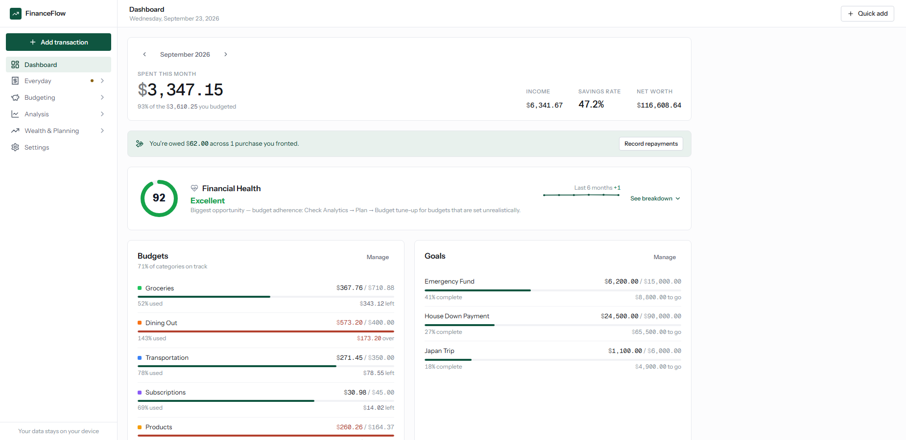

---

## Why it's interesting

**Two runtimes, one codebase.** The same React app persists to SQLite when it runs in Electron
and to `localStorage` when it runs in a browser. The renderer calls one storage module; that
module picks its backend at runtime from whether the preload bridge is present
([`src/storage/storage.js`](src/storage/storage.js)). No forks, no build flags.

**Privacy enforced by construction, not by convention.** Every outbound AI request is assembled
in [`electron/ai/payload.cjs`](electron/ai/payload.cjs) from an explicit per-feature allow-list.
A field that isn't listed cannot be sent, and an unrecognized feature name throws rather than
falling through to an unfiltered object. The privacy promise in this README is a property of the
code path, not a policy.

**The Electron surface is deliberately small.** `contextIsolation` is on, `nodeIntegration` is
off, and the renderer reaches the main process only through the explicit API in
[`electron/preload.cjs`](electron/preload.cjs). The API key is encrypted with OS-backed storage
(DPAPI/Keychain via Electron `safeStorage`), lives only in the main process, and exists in
plaintext only in memory at call time.

**The financial logic is real, and tested.** Budget rollover, recurring-charge detection,
duplicate detection, reimbursement-aware spending, goal pacing, debt avalanche/snowball, a
long-range life plan with Canadian tax treatment (RRSP/TFSA/FHSA, CPP/OAS, first-time-buyer
rules) and a Monte Carlo simulation. Roughly 9k lines of source and **244 unit tests**.
Functions that depend on "now" take an explicit date, so they're deterministic under test.

## Features

| Page | What it does |
|------|-------------|
| **Dashboard** | Budget progress, savings goals, anomaly alerts, net worth, financial health score |
| **Transactions** | Full ledger with search/filter, CSV import/export, inline edit, AI receipt paste |
| **Owed to Me** | Purchases fronted for other people: split evenly or by amount, track partial repayments, forgive the remainder |
| **Budget** | Monthly limits per category, flex thresholds, and real rollover (prior month's unused or overage carries forward) |
| **Comparison** | Budget vs actual side by side, grouped bar chart, 6-month trend table |
| **Analytics** | What changed, cash-flow forecast, savings opportunities, duplicate charges, irregular/seasonal bills, budget tune-up, goal check, spending habits, tags |
| **Goals** | Progress derived from actual savings transactions, scenario calculator, pace vs. required contribution |
| **Income** | Multiple sources, frequency normalization, income vs expense chart |
| **Investments** | Allocation, gain/loss, compound projection, and tracked "advisor" accounts that grow from a statement balance with logged deposits/withdrawals |
| **Debts** | Payoff calculator, avalanche vs snowball comparison, interest-free and deferred loans (accrue nothing / pay nothing until repayment starts) |
| **Recurring** | Detects recurring charges from history, then posts them on schedule from confirmed templates |
| **Plan Ahead** | Long-range monthly projection to retirement: house purchase (CMHC, land transfer tax, FHSA/HBP), car financing, one-off and recurring life events, Canadian tax, saved scenarios, and a Monte Carlo success rate |
| **Reports** | Monthly, YTD and custom-range summaries, CSV/JSON export, AI insights and Q&A |
| **Settings** | API key management, AI toggle, demo data, JSON backup/restore |

## Screenshots

**Plan Ahead — a month-by-month projection from today's balances to age 95: salary growth and
RRSP contributions, a car in 2027, a wedding in 2028 and a first home in 2029, with Ontario and
federal tax applied each year and CPP/OAS starting at the chosen ages.**
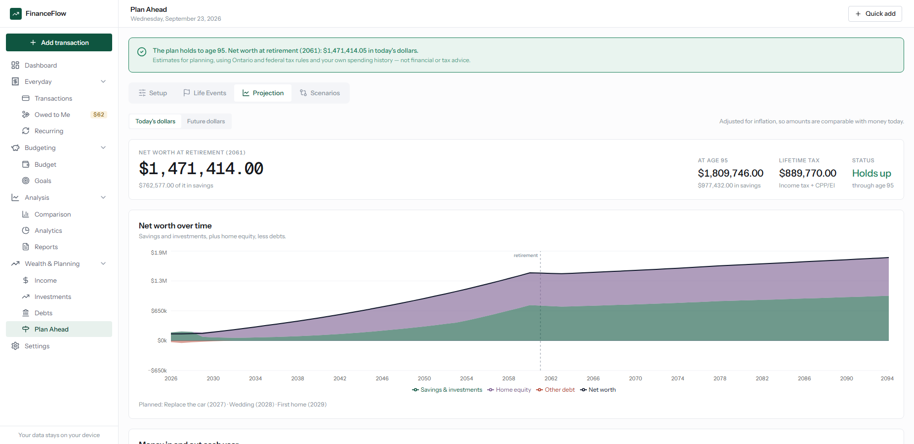

**…then run it a few hundred times with a random return each year, instead of the same return
every year, to see how often the plan survives.**
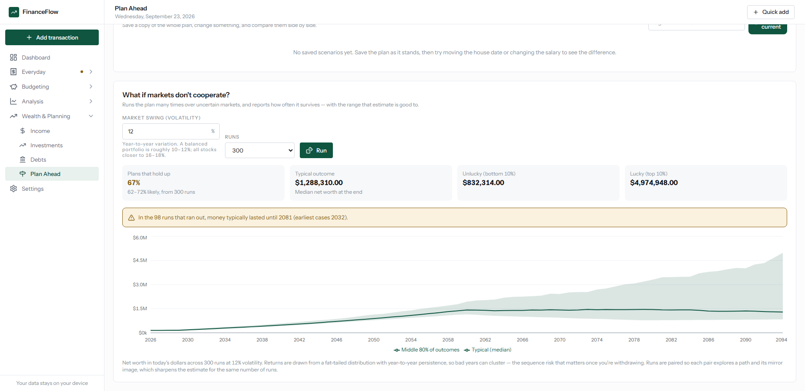

**Analytics — what changed this month, against your own baseline rather than a fixed budget.**
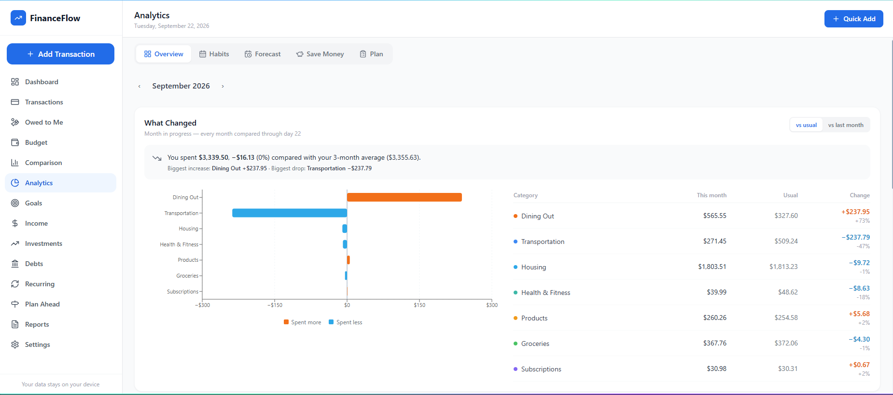

**Budget — real rollover. Unused room carries forward (`+$160.88 rolled over`), and an overage
carries as a deduction (`-$135.63 carried`), so the percentages track the *effective* limit.**
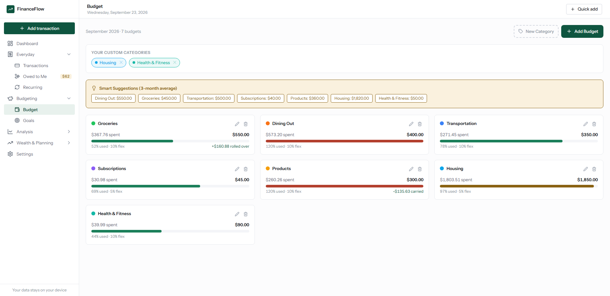

**Owed to Me — a dinner split four ways, two repayments logged. The full amount counts as your
spending until it comes back, and each repayment lowers that purchase's month.**
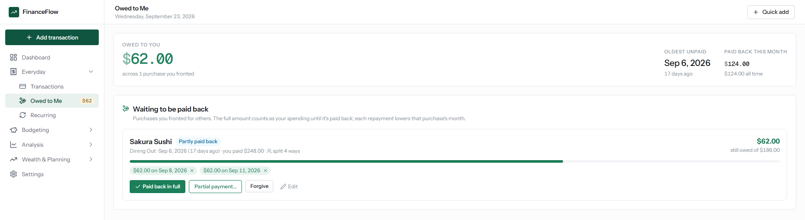

**Debts — an interest-free OSAP loan still in deferment: nothing due until repayment starts, and
no interest accrues meanwhile.**
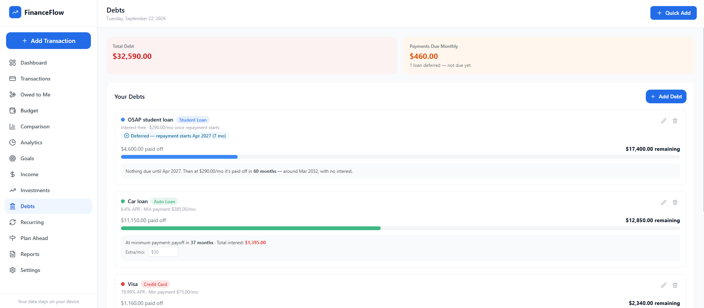

<details>
<summary>More: plan setup, transactions, goals, budget vs actual</summary>

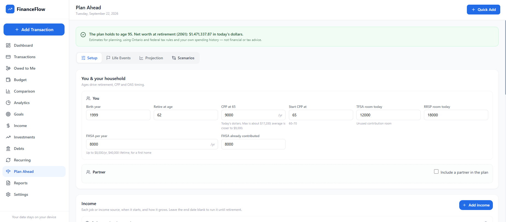

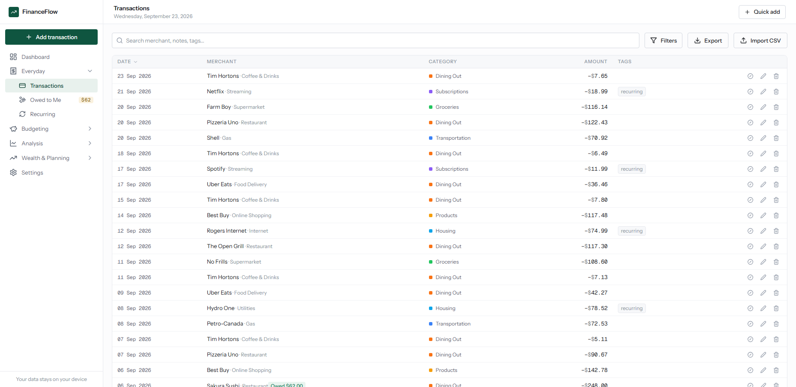

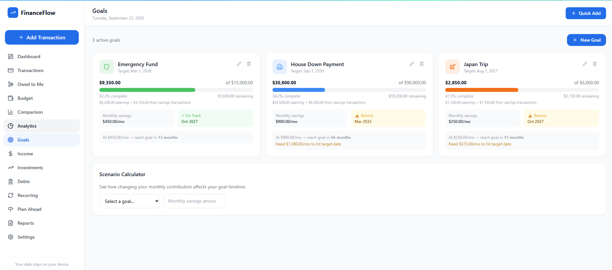

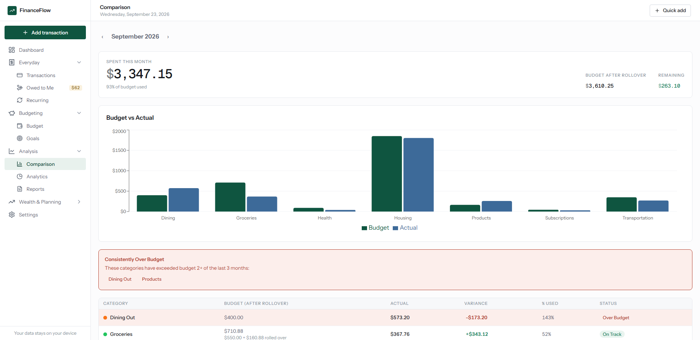

</details>

## Architecture

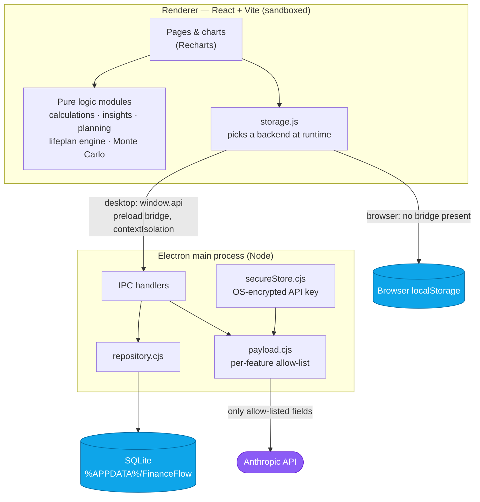

The renderer has no filesystem, database or network access of its own. Everything crosses one
narrow, explicit bridge.

## AI features (desktop only, opt-in, off by default)

Enable in **Settings** by entering your own Anthropic API key and turning on the toggle.

1. **Smart auto-categorization** — keyword matching first; only on a miss does the model decide. Your manual corrections are remembered locally and win next time.
2. **Natural-language entry** — "spent $40 on gas at Esso yesterday" fills the transaction form.
3. **Insights & Q&A** — a narrative monthly summary and grounded answers, computed from aggregates.
4. **Receipt / statement parsing** — paste messy text, get structured transactions.

Routine calls use Sonnet and the heavier reasoning pass uses Opus, both through forced tool-use
for structured output, with cacheable system prompts. Every AI path has a deterministic fallback,
so the app is fully functional with AI off or offline.

**No key required to develop against them.** `npm run electron:dev:mock` points the SDK at a
local stand-in for the API ([`electron/ai/mockServer.cjs`](electron/ai/mockServer.cjs)) that
answers from the real request, and can be told to return a 401, a 429, a malformed body or an
invalid category on demand — so the failure paths get exercised, not just the happy one. See
[DEVELOPMENT.md](DEVELOPMENT.md#testing-the-ai-features-without-an-api-key).

## Privacy

- **Your data stays local.** SQLite (desktop) and `localStorage` (browser) never leave your machine.
- **No AI, nothing sent.** With AI off — the default — or with no API key, nothing is transmitted.
- **With AI on, only the allow-listed fields per feature are sent:**

  | Feature | What is sent |
  |---|---|
  | Categorization | The merchant name + the category list. No amounts, no other transactions. |
  | Natural-language entry | Your typed text + today's date + the category list. |
  | Insights & Q&A | **Aggregates only** — monthly/category totals, budget status, anomalies. Never individual transactions. |
  | Receipt parsing | The text you paste (unavoidable) + the category list. |

- **The key** is encrypted through the OS keychain, never bundled and never committed.

## Running it

| Command | What it does |
|---|---|
| `npm run dev` | Browser app at `http://localhost:5173` (localStorage) |
| `npm run electron:dev` | Desktop app in development (SQLite) |
| `npm run electron:dev:mock` | Desktop app with AI wired to the local mock (no key, no spend) |
| `npm test` | Unit tests (244) |
| `npm run build` | Production web bundle |
| `npm run dist` | Windows installer into `release/` |

⚠️ `better-sqlite3` is a native module, and Node and Electron use different ABIs, so the binary
matches only one at a time: `npm rebuild better-sqlite3 --build-from-source` before `npm test`,
`npx electron-builder install-app-deps` before running the desktop app. `npm run dist` handles it
itself. Details in [DEVELOPMENT.md](DEVELOPMENT.md).

## Design decisions

**Electron over Tauri.** Tauri produces much smaller binaries, but the whole codebase is
JavaScript and the app needed an embedded database plus OS-level key encryption on day one.
Electron's `better-sqlite3` and `safeStorage` cover both with no Rust toolchain in the loop.

**A hybrid SQLite schema.** `transactions` promotes the queryable fields (date, amount, category,
…) into real columns for indexed aggregates, while every table also keeps the complete original
object in a `data` JSON column. Nothing is lost on a round-trip when the JS object shape evolves,
and columns can be promoted later when a feature needs to query them.

**State is saved as a whole blob on change.** The renderer keeps a single reducer store and
persists all of it per change, which keeps the storage interface identical across both runtimes.
At personal-ledger scale this is comfortably fast; per-entity writes would be the first thing to
change if it grew.

**The life plan lives in settings, not new tables.** Plan Ahead is a projection over existing
state plus a config object, so it needed no schema change — and its engine stays pure and
testable.

## Tech stack

React 18 · Vite · Tailwind CSS · Recharts · date-fns · Electron · better-sqlite3 ·
@anthropic-ai/sdk · Vitest + Testing Library
