# FinanceFlow

**A local-first personal finance app for Windows and the browser, with optional AI
features that are limited, in code, to the minimum data each one needs.**

**[Live demo in your browser →](https://jrhughes003.github.io/financeflow/)** (nothing to
install, loaded with generated data) ·
**[Windows installer (latest release) →](https://github.com/jrhughes003/financeflow/releases/latest)**

[](https://github.com/jrhughes003/financeflow/actions/workflows/ci.yml)
[](LICENSE)

## What's different

Budgets, goals and charts are table stakes for a finance app. FinanceFlow covers those,
but three things set it apart:

- **AI that can't see more than it needs.** Every request to the AI is assembled from a
  per-feature allow-list ([`payload.cjs`](electron/ai/payload.cjs)). A field that isn't
  listed can't be sent, and the app shows you the verbatim requests it made.
  - When you ask a question about your money, the model never receives a raw
    transaction.
  - Instead, it calls tools that compute specific totals on your machine, and only those
    totals go back.
- **An evaluation that scores trust separately from correctness.** For money questions, a
  confident wrong number is the worst outcome. The Q&A eval checks every figure in an
  answer against the numbers the tools actually returned, using a programmatic grader
  rather than another LLM, and never averages "safe" and "right" together.
- **A local classifier with an honest comparison.** A small model trained on your own
  ledger categorises merchants it has seen before, for free and offline. It was measured
  against the keyword rules. It wins on familiar merchants and loses badly on unfamiliar
  ones, so the app only lets it answer where keywords have nothing to say.

**Skills demonstrated:** TypeScript/React · Electron security (context isolation, CSP,
narrow IPC, OS-encrypted secrets) · SQLite · LLM tool use with the Anthropic API · eval
design · testing and CI (Vitest, Playwright, coverage gates) · release engineering (tagged
Windows builds with package verification and checksums).

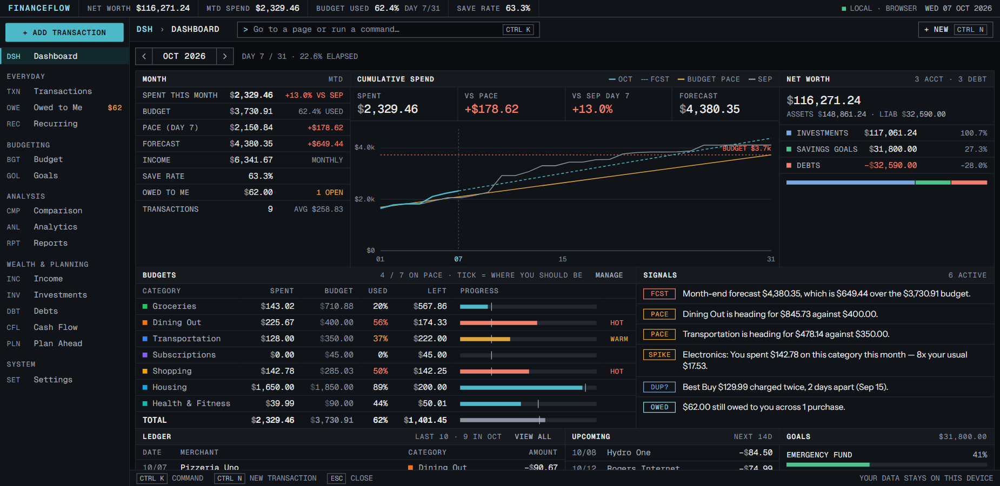

## Privacy: what the AI features can send

Your ledger stays on your machine: SQLite on the desktop, `localStorage` in the browser.
AI is off by default, desktop only, and needs your own API key. With it off, nothing is
sent. With it on, each feature sends only its allow-listed fields:

| Feature | What is sent |
|---|---|
| Categorization | The merchant name you typed, plus the category list. Only when keywords and the local classifier have no confident answer. No amounts. |
| Natural-language entry | The text you typed, today's date and the category list |
| Insights | Aggregates only: totals, per-category figures, budget status, forecasts, counts of flagged items, and your goals and debts by name. Never an individual transaction or a merchant name. |
| Q&A | Your question, today's date and the category ids. After that, never a raw transaction, only the specific aggregates the model asks for, computed locally. |
| Receipt parsing | The text you paste, plus the category list |

**Settings → What was sent** shows the most recent requests (up to 20) from this session,
with their verbatim bodies. It is recorded at the SDK, so it includes the aggregates that
Q&A returns in later turns.

The full breakdown is in **[docs/PRIVACY.md](docs/PRIVACY.md)**. It covers what each Q&A
tool can return, the edge cases, and how the API key is stored.

## Measuring the Q&A

The eval in [`eval/`](eval/) scores every answer on two separate measures:

| Metric | What it asks |
|---|---|
| **trust** | Did every monetary figure in the answer come from a number a tool actually returned, or a simple ratio or difference of two? |
| **correct** | When there was a right figure, did the answer contain it? |

- "I can't see that" scores trust 1, correct 0: unhelpful but safe. A confident wrong
  number scores trust 0.
- **The grader is code, not an LLM judge.** Tool results are captured during the run, so
  "was this number sourced?" is decidable.
- **The cases:** 25 of them, including six real questions I asked the app (typos
  included) and four with no honest answer.
- **Independent expected figures:** these are computed from the demo ledger by separate
  code, so a bug in the tools can't grade itself correct.
- **The real code path:** the eval runs the same code the app ships.
- **No scores yet:** results from a real run have not been published. When they are,
  they will be two numbers, not one.

Details, including the classifier measurement below, are in **[docs/AI.md](docs/AI.md)**.

## The local classifier, measured

The measurement is 5-fold cross-validation on the demo ledger (249 labelled rows, 32
merchants). When the classifier is unsure, it falls back to the keyword answer, and those
fallbacks are scored.

| Question | Keywords | Classifier |
|---|---:|---:|
| Accuracy on a merchant never seen before | **91.2%** | 42.6% |
| Accuracy on a merchant already in the ledger | 91.2% | **96.0%** |

What the measurement shows:
- On merchants it has seen before, the classifier is more accurate. But its macro-F1 is
  lower (0.74 against 0.81), so it is weaker on small categories.
- On merchants it has never seen, keywords win clearly. So the order in the app is
  keywords first, then the classifier, then the AI model.
- The demo ledger flatters keywords, because its merchants were drawn from the keyword
  lists.

## Screenshots

**Plan Ahead:** a month-by-month projection to retirement, with Canadian tax, a home
purchase and life events.
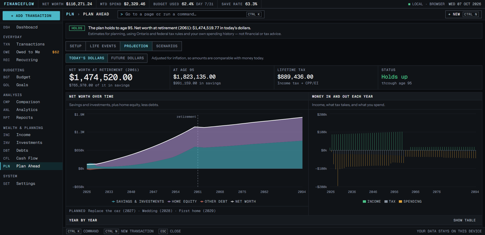

**Monte Carlo:** the same plan run a few hundred times with random yearly returns, to see
how often it holds up.
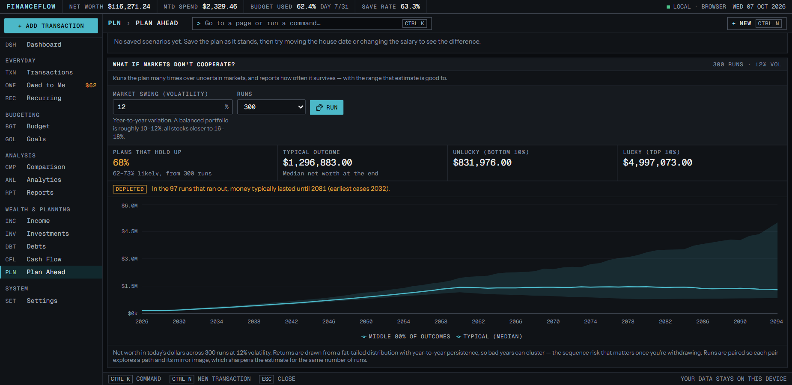

**Analytics:** what changed this month, against your own baseline rather than a fixed
budget.
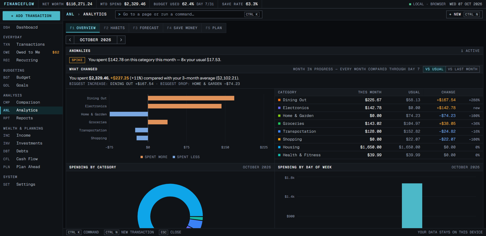

<details>
<summary>More: budget rollover, money owed to you, debts, plan setup, transactions, goals, budget vs actual</summary>

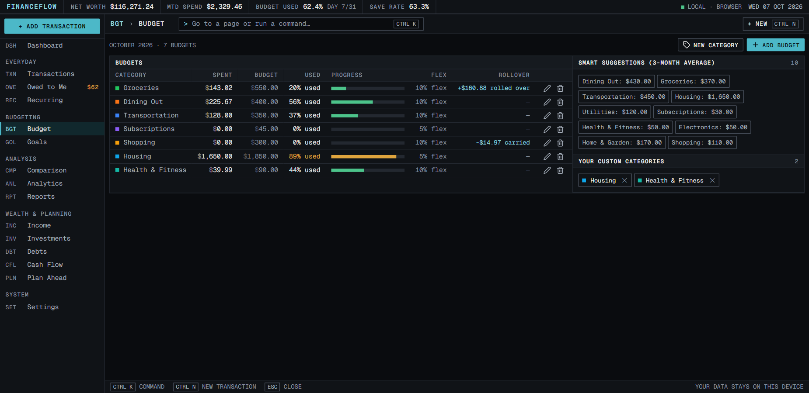

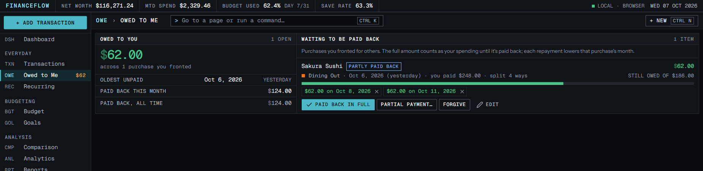

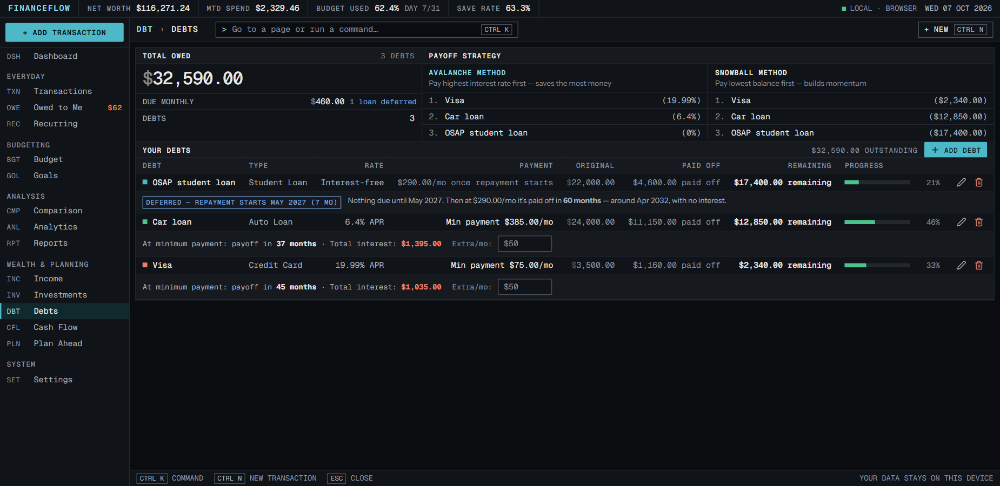

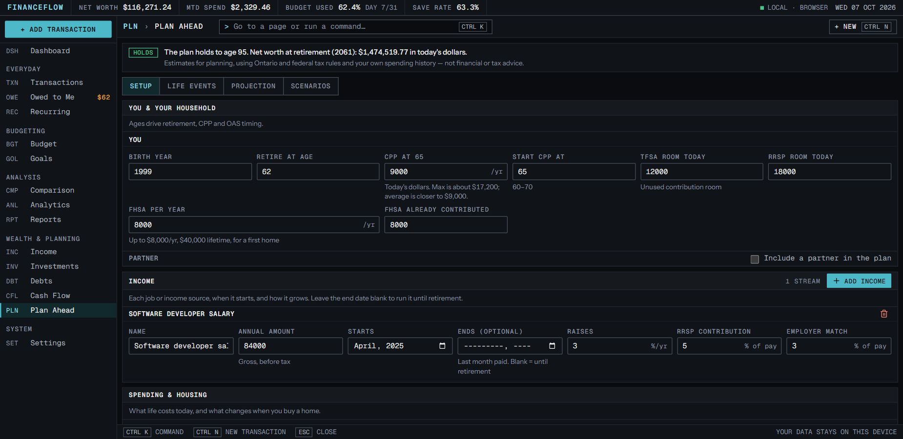

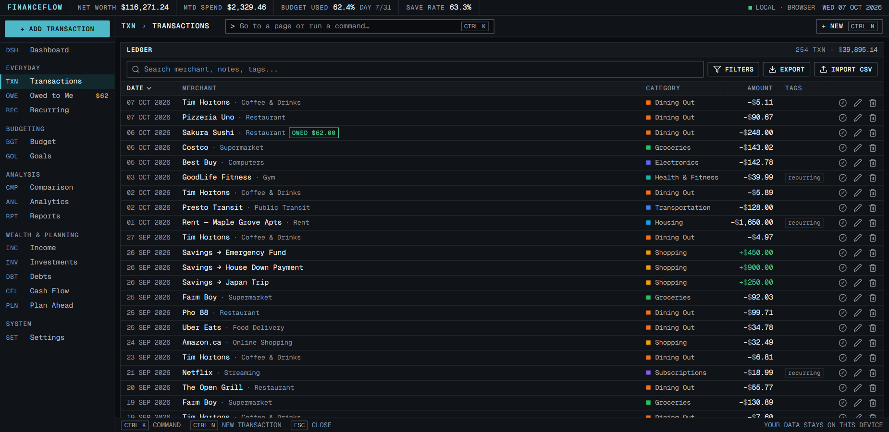

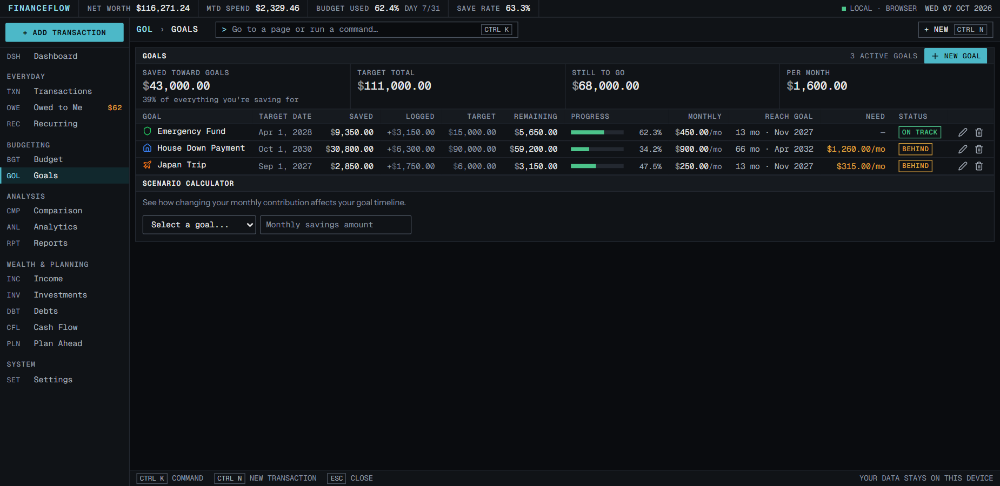

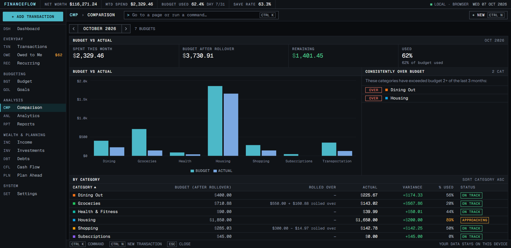

</details>

## What it does

The app has 14 pages:
- a ledger with CSV import and export;
- budgets with real rollover, and budget vs actual;
- analytics: what changed, cash-flow forecast, duplicate charges, savings opportunities;
- goals, income, investments, and debts (avalanche vs snowball, deferred loans);
- money owed to you for fronted purchases;
- recurring-charge detection;
- **Plan Ahead**, a long-range plan with Canadian tax treatment (RRSP/TFSA/FHSA, CPP/OAS,
  first-time-buyer rules) and a Monte Carlo success rate.

The full feature table and captioned screenshots are in
[docs/FEATURES.md](docs/FEATURES.md).

**Engineering:**
- **One codebase, two runtimes:** the same React app persists to SQLite in Electron and
  to `localStorage` in the browser, choosing the backend at runtime.
- **A hardened Electron app:**
  - `contextIsolation` and `sandbox` on, `nodeIntegration` off;
  - a ten-method preload bridge;
  - a Content-Security-Policy with `connect-src 'none'`;
  - the API key encrypted with OS-backed `safeStorage`, and held only in the main process.
- **Tests:** Roughly 26k lines of source and **994 unit tests**, plus one end-to-end
  Playwright test.
- **CI** runs typecheck and lint, tests with coverage gates on Ubuntu and Windows, and
  checks that the figures in this README are current.
- **Releases:** tagged commits build the Windows installer in GitHub Actions. Each build
  verifies the packaged archive before release and publishes SHA-256 checksums.

Architecture diagram and design decisions: [docs/ARCHITECTURE.md](docs/ARCHITECTURE.md).

## Get it

**Windows desktop:** [download the installer from the latest release](https://github.com/jrhughes003/financeflow/releases/latest).
- It installs for the current user, with no administrator rights needed.
- It keeps your database at `%APPDATA%\FinanceFlow\financeflow.db`.
- The installer is **not code-signed**, so Windows SmartScreen will warn the first time.
  Choose **More info → Run anyway** if you trust it. Otherwise, use the browser demo, or
  build the identical installer yourself with `npm run dist`.

**Browser, from source** (needs no native module):

```bash
npm install
npm run dev          # browser at http://localhost:5173
```

Then open **Settings → Load demo data** for about 8 months of generated history. The live
demo is the same bundle, built with `VITE_DEMO_MODE=true`. The AI features need the
desktop build.

| Command | What it does |
|---|---|
| `npm run dev` | Browser app at `http://localhost:5173` (localStorage) |
| `npm run electron:dev` | Desktop app in development (SQLite) |
| `npm run electron:dev:mock` | Desktop app with AI wired to a local mock of the API (no key, no spend) |
| `npm test` | Unit tests (994) |
| `npm run test:e2e` | One end-to-end test in a real browser (Playwright) |
| `npm run dist` | Windows installer into `release/` |

⚠️ `better-sqlite3` is a native module, and Node and Electron use different ABIs. Run
`npm rebuild better-sqlite3 --build-from-source` before `npm test`, and
`npx electron-builder install-app-deps` before running the desktop app. Details are in
[DEVELOPMENT.md](DEVELOPMENT.md).

## How this was built

**It started as my own hand-built React app.** The March and May 2026 commits, about 6k
lines, are mine. They contain:
- the core pages (ledger, budgets, goals, debts, investments, reports);
- then a first Electron + SQLite desktop version with the first AI features and the
  per-feature allow-list.

**From September 2026 it was substantially extended with Claude Code**, Anthropic's AI
coding agent. Every commit since then credits it as co-author: 92 of the 95 commits. That
work includes:
- the Q&A tool-use design and the "What was sent" log;
- the eval and the local classifier;
- Plan Ahead and the Monte Carlo simulation;
- the TypeScript migration;
- most of the tests, CI and the release pipeline.

**I set the direction, deciding what to build and in what order, and I use the app day
to day.** Six of the eval's test questions are ones I actually asked it, typos included.

## Also in here

- [docs/PRIVACY.md](docs/PRIVACY.md): exactly what each AI feature can send.
- [docs/AI.md](docs/AI.md): the AI features, the Q&A eval and the classifier measurement.
- [docs/ARCHITECTURE.md](docs/ARCHITECTURE.md): the diagram, Electron hardening and design
  decisions.
- [docs/FEATURES.md](docs/FEATURES.md): every page, with captioned screenshots.
- [DEVELOPMENT.md](DEVELOPMENT.md): running it, the native-module ABI trap, and exercising
  every AI failure path against a local mock.
- [CONTRIBUTING.md](CONTRIBUTING.md): the gates, and what the code expects of a change.
- [SECURITY.md](SECURITY.md): the threat model, with the limitations stated.
- [CHANGELOG.md](CHANGELOG.md): what changed, including what each bug actually did.
