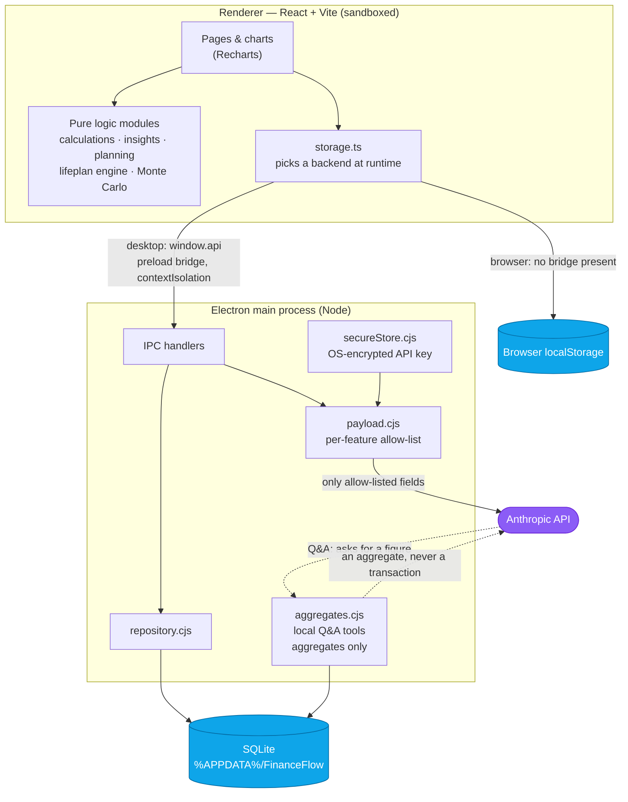

# Architecture and design decisions

The renderer has no filesystem, database or network access of its own. Everything crosses
one narrow, explicit bridge.

## Two runtimes, one codebase

The same React app persists to SQLite when it runs in Electron, and to `localStorage` when
it runs in a browser. The renderer calls one storage module, and that module picks its
backend at runtime from whether the preload bridge is present
([`src/storage/storage.ts`](../src/storage/storage.ts)). There are no forks and no build
flags.

## A small Electron surface

- **Renderer isolation:** `contextIsolation` and `sandbox` are on, and `nodeIntegration`
  is off.
- **One bridge:** the renderer reaches the main process only through the ten methods
  exposed in [`electron/preload.cjs`](../electron/preload.cjs).
- **No windows or navigation:** window opening is denied, and real web links go to the
  system browser. Navigation is blocked except to the dev server and `file:`.
- **Content-Security-Policy:** the packaged app sends one with `connect-src 'none'`, and
  the built HTML carries the same policy as a `<meta>` backstop.
- **The API key:** it is encrypted with Electron `safeStorage` and lives only in the main
  process.

Details are in [SECURITY.md](../SECURITY.md) and [PRIVACY.md](PRIVACY.md).

## Design decisions

**Electron over Tauri.** Tauri produces much smaller binaries. But the whole codebase is
JavaScript/TypeScript, and the app needed an embedded database and OS-level key encryption
from the start. Electron's `better-sqlite3` and `safeStorage` cover both with no Rust
toolchain in the loop.

**A hybrid SQLite schema.** `transactions` promotes the queryable fields (date, amount,
category and so on) into real columns for indexed aggregates. Every table also keeps the
complete original object in a `data` JSON column. Nothing is lost on a round-trip when the
object shape evolves, and columns can be promoted later when a feature needs to query them.

**State is saved as a whole blob on change.** The renderer keeps a single reducer store
and persists all of it on each change. This keeps the storage interface identical across
both runtimes. At personal-ledger scale it is comfortably fast; per-entity writes would be
the first thing to change if it grew.

**The life plan lives in settings, not new tables.** Plan Ahead is a projection over the
existing state plus a config object. It needed no schema change, and its engine stays pure
and testable.

**Deterministic logic.** Functions that depend on "now" take an explicit date, so they are
deterministic under test. The Monte Carlo simulation and the debt-payoff comparison run in
Web Workers, with an in-process fallback.

## Tech stack

TypeScript · React 19 · Vite · Tailwind CSS · Recharts · date-fns · Electron ·
better-sqlite3 · @anthropic-ai/sdk · Vitest + Testing Library + fast-check · Playwright ·
electron-builder
